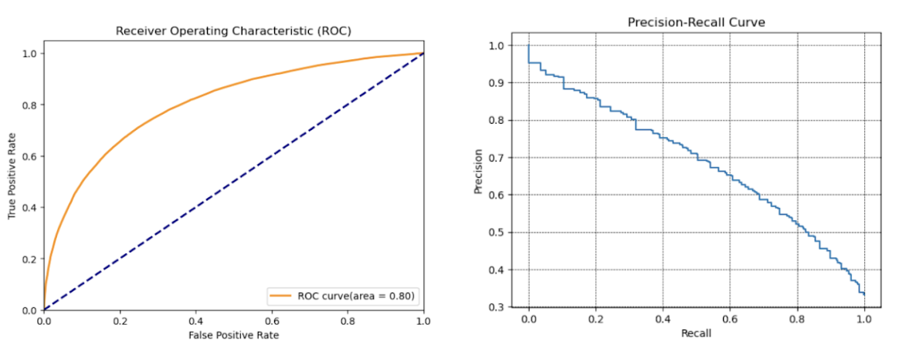
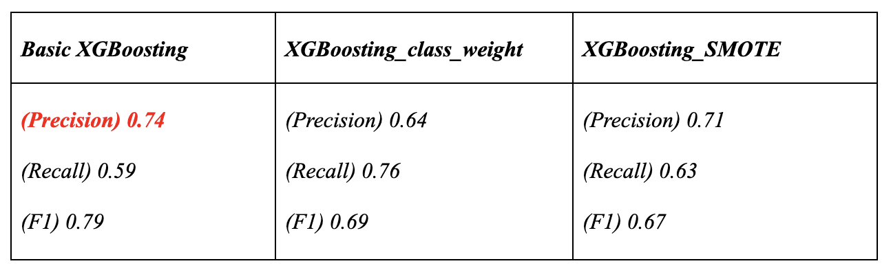

# Predictive Analysis of In-App Purchase Availability and Transparency
## **Introduction**
***Overview of Dataset***
>- The project trained ensemble models using 2M data entries from the "2017~2020 Google Play Store Applications" dataset by majority
voting method and compared metrics with individual models to aid investors in decision-making.
>- I used the "Google Play Store Applications" dataset collected in June 2021 in our final project. The initial dataset had 2,312,944 entries and 24 features.

***Data Dictionary***

After reviewing the features of the initial dataset, I am curious about the availability and transparency of “In-App Purchases” and see the role it plays in shaping user preferences, app strategies, and the overall competitiveness and success of mobile applications in the market.
>***Use Cases:***
>- Role: Software Investor
>- Goal: Assists investors in identifying and leveraging the features of mobile apps that maximize their benefits.
>- Approach: Identify the best model for maximizing your company's benefits by predicting whether or not an app has "in-app purchases," allowing investors to develop a more effective strategy for finding the apps with the highest ROI.

>***Model Selection:***
>Given that our target variable, "In-App Purchase," and the majority of variables in the dataset are categorical values (True/False), we >conducted three tree-based classifier models in this report.
>- Random Forest Classifier
>- Decision Tree Classifier
>- Gradient Boosting Classifier

>***Metrics for Model Evaluation(Classification Model):***
>- Confusion Matrix
>- Precision / Recall / F-1 Score
>- Receiver Operating Characteristic Curve (ROC) and Area Under the Curve (AUC)
>- Precision-Recall Curve

Precision is a crucial metric in this report. In the mobile app store market, the cost of false positives (predicting In-App purchases when they won't occur) is significant. Therefore, our prediction strategy focuses on minimizing false positives and ensuring accurate positive predictions to maximize profits from In-App purchases.
In contrast, the cost of false negatives (missed In-App purchases) is not high in our case, as we assume the cost of encouraging purchases is relatively low. Even if a purchase would have occurred naturally without our efforts, the additional cost is not substantial.
## **Data Resampling and Cleaning**

***Undersampling***

I first checked the data distribution of the target variable “In-App Purchases” and the variable contained the class imbalance issue. The percentage of "false" is 91.6%, significantly higher than the 8.44% of "true." Therefore, we resample the data by using undersampling.

After the undersampling, we changed the proportion of “false” and “true” to 2:1. Since a specific percentage difference can accurately represent the real data distribution, we have chosen to retain some data imbalance and have not adjusted the ratio between the two categories to make them equal.

***Droping Columns***

I dropped the columns that are highly unique or contain non-related information, such as URL or email address.

***Missing Values***

I examined the dataset for null values, and the table below displays the total count of missing values for each variable that contains null values.

## **Data Transform and Imputation**

The dataset contained complicated categorical data, and many columns required preprocessing to be used for analysis and modeling.

***Extraction and Converting Data for Analysis***

***Data Encoding***

I applied **LabelEncoder()** from sklearn to encode the categorical values.

***Outlier***

I checked the outlier of numerical variables using **IQR value and box plot**.

Additionally, I only processed the outliers in **Install_Avg** and retain outliers in other fields to accurately represent real-world app store installation situations.

## **Exploratory Data Analysis**

After initializing the data cleaning and imputation, we conducted an exploration of the variables.

>"Install_Avg" and "In-App Purchases" relationship: When "In-App Purchases" is 0, the average "Install Avg" is significantly higher at 130,870, compared to 1,195,096 when "In-App Purchases" is 1.

>"Size_numeric(KB)" and "In-App Purchases" relationship: Apps with "In-App Purchases" set to 1 have a larger average size of 34,122 compared to 18,781 for apps with "In-App Purchases" set to 0.

>"Rating Count" and purchase correlation: Apps with more rating counts are more likely to be purchased. When "In-App Purchases" is 0, the average "Rating Count" is 2.10, while it's 3.27 when "In-App Purchases" is 1.

>Influence of "Min version": The average values are similar for different "In-App Purchases" values, but apps with "In-App Purchases" set to 1 tend to support slightly higher versions.

>Impact of “Ad Supported”: Approximately 56 percent of apps have advertisements, and those with ads have a purchase ratio of 43 percent, significantly higher than the 20 percent purchase rate for ad-free apps.

>"Editor's Choice" and purchase rate: Only 0.1 percent of apps are chosen by editors. For editor's choice apps, the purchase rate is 94 percent, while apps not chosen by editors have a 33 percent purchase rate.

>- In the correlation heatmap, we find that " Update interval days", "Ratings" and "Rating Count" are strongly and positively correlated, with correlation coefficients close to 1.
>- "In-App Purchases" is positively correlated with "Rating", "Rating Count", "Ad Support", "Update interval days" and "size_numeric(KB)" with a correlation around 0.25.
>- "Price" and "Free" are negatively correlated with a correlation coefficient around -0.25.

In addition, we observed that when apps had a higher number of rating counts, they were more likely to be purchased.
## **Data Modeling Preprocessing**
***Target and Feature variables***

***Data Splitting and Normalization***

We imported the train_test_split function from sklearn.model_selection to randomly split the train and test datasets. Import StandardScaler from sklearn.preprocessing to normalize feature variables.

## **Random Forest Classifier**

***Hyperparameter Tunning (Cross Validation)***

In hyperparameter tuning, we import the **RandomizedSearchCV** function from **sklearn.model_selection** to optimize the model's performance. We apply the best hyperparameter on the train datasets (X_train, y_train).

Pairs of parameters were examined using cross-validation, and the best parameters were selected based on the 'Precision' score, which considers balanced model performance.

***Model_Tuning (Controlling imBalance)***

The target variable exhibited an imbalance, with the number of data points labeled as '1' constituting 33% of the total data, while '0' accounted for the rest. While the imbalance was not severe, we sought to enhance the model's performance by applying class weights and **SMOTE (Synthetic Minority Over-sampling Technique)**.

After applying class weights and SMOTE, the F1 score improved; however, our primary metric of interest, 'precision,' did not exhibit the same improvement. As a result, we concluded that the basic Random Forest model, without any further tuning, performed best for our purposes.

***Model Evaluation***

The best random forest model has a precision of 0.73, a recall of 0.53, and an F1-score of 0.61. Comparatively, higher precision and lower recall indicate a large number of False Negatives. As seen in the confusion matrix, there are 13,688 positives ('purchased') misclassified as negatives ('no purchased'). In comparison, the number of False Positives is low at 5512. This model exhibits higher precision and comparably lower recall.

Additionally, we examined the ROC curve, which enables us to assess the trade-offs between True Positive Rates and False Positive Rates. The ROC curve allows us to compare the TPR and FPR. The TPR was 0.52, and the FPR was 0.473. Both scores were similar, but the curve displayed a noticeable deviation from the top-left corner (0,1), indicating a gap from the ideal score of 1. When considering the slightly higher TPR, the model is more effective at correctly identifying positive cases, thereby minimizing false negatives.

The Precision-Recall curve (PR curve) reflects poor performance in terms of recall. The **recall score is low at 0.53**, resulting in a significant gap between the top-right corner (1,1) and the curve. Ideally, the curve should closely approach the corner, but this gap indicates a substantial distance between the corner and the curve. This reflects the model's poor recall scores, indicating that it struggles to properly distinguish positive values.
Additionally, it took **1.53 seconds to train this model**.

***Feature Importance***

In the Random forest, the following features were considered important features in the specified order: ‘Update Interval Days’, 'Rating', 'Min Version', ‘Category’, Rating Count', ‘Editors Choice’, 'Free', 'size_numeric(KB)', 'Ad supported', ‘Currency’, ‘Price','Installs_average' and , 'Content Rating'.

**Update Interval Days** plays a significant role in reducing impurity, suggesting that it's a strong predictor for splitting the data at the root node or top-level nodes of the decision trees in the forest. 'Rating' is the second most important feature for reducing impurity, indicating its importance in making decisions in the trees. On the other hand, 'Price,' 'Installs_average,' and 'Content Rating' reduce less impurity, while the other features show similar impacts on reducing impurity.

The **Update Interval Days** has the most significant impact. When the 'Update Interval Days' are lower (closer to 0), the average 'In App Purchases' is also lower, at around 0.16 to 0.32. As 'Update Interval Days' increase, the average 'In App Purchases' generally show an upward trend, peaking at around 0.51 for an 'Update Interval Days' of 4.9. Additionally, the 'Rating' also has a notable effect on the increase in 'In-App Purchases.' When the rating increases, the purchases have lower figures, while with an increasing rating, the purchases increase. However, when comparing other features, such as price, install_avg, and content_Rating, they did not appear to significantly affect purchase.

## **Decision Tree Classifier**
***Hyperparameter Tunning***

Random search was chosen for hyperparameter tuning, as random search is a more efficient method than grid search, especially in the case of large-scale hyperparameter spaces. Accuracy was set as the scoring criterion for the random search and 5-fold cross-validation was performed. Precision measures the accuracy of the model in positive category prediction. Cross-validation helps to evaluate the performance of the model without relying too much on the randomness of a single data partition.

***Model_Tuning (Controlling imBalance)***

The ratio of 1 and 0 data adjusted by the undersampling method is 1:2. Although the imbalance is not serious, we tried to further improve the model's performance by applying class weights and SMOTE.

After applying class weights and SMOTE, the F1 score improved, but the main metric we were concerned with, "precision", showed a significant decrease. Therefore, we conclude that the basic decision tree model best suits our purposes.

***Model Evaluation***

The test set was brought into the decision tree model with optimal hyperparameters for prediction. The resulting confusion matrix is shown below, and the model is optimized due to the imbalance in the category distribution of the target variable being balanced by the undersampling method. 0 (false) still has a higher prediction accuracy than 1 (true), but the model has a significant increase in the accuracy of the 1-category predictions.

>**Confusion Matrix:**
>The optimal decision tree model had a precision of 0.71, a recall of 0.50, and an F1 score of 0.59. The relatively high precision and low recall indicate a large number of false negatives. The confusion matrix shows that 14,338 positive values ("purchases") were misclassified as negative values ("no purchases"). In contrast, the number of positive values misclassified in the predictions is low at 6010. The model has high precision and relatively low recall.

>**ROC Curve and Precision-Recall Curve:**
>The ROC curve is a graphical tool used to evaluate the performance of a binary classification model, which helps me to better understand the performance of the model.AUC is a measure of the area under the ROC curve, which represents the combined performance of the model at all possible thresholds.The closer the AUC is to 1, the better the performance of the model. The model computes an AUC value of about 0.80, which is a good performance. This proves that our treatment of the imbalance problem is effective.

>The Precision-Recall curve (PR curve) reflects poor recall performance. The recall score is low, resulting in a significant gap between the upper right corner (1,1) and the curve. This reflects that the model does not discriminate well on the true positive value (1).

***Feature Importance***

Feature importance is a concept in machine learning that indicates the extent to which each feature (or variable) in a dataset contributes to the prediction or output of a model. In decision tree classification models, feature importance is usually defined by measuring the contribution of each feature during the splitting of tree nodes. This model relies on Gini impurity decrease as a measure. The greater the feature's contribution to reducing uncertainty, the higher its importance.

According to the bar chart, the following features are considered important in the specified order: "install_avg", "size_numeric(KB)", "Ad_Supported", “Category”, "Min Version", "Content Rating", "Rating Count", "Update interval Days", and “Rating”, "Free", “Price”, “Currency”, " Editors Choice" is not considered an important feature. The reason for the highest score for "install_avg" might be that this variable is equivalent to reflection of the number of people who use the app, which helps to study the presence or absence of in-app purchases.

## **Gradient Boosting Classifier**
***Hyperparameter Tunning (Cross Validation)***

In hyperparameter tuning, we import the **RandomizedSearchCV** function from **sklearn.model_selection** to optimize the model's performance. We apply the best hyperparameter on the train datasets (X_train, y_train)

Pairs of parameters were examined using cross-validation, and the best parameters were selected based on the 'Precision' score, which considers balanced model performance.

***Model_Tuning (Controlling imBalance)***

To enhance the data imbalance performance, we implemented class_weights and employed SMOTE (Synthetic Minority Over-sampling Technique).
Following these adjustments, the F1 score showed improvement in class_weight, although our main focus, 'precision,' didn't exhibit the same enhancement. As a result, we determined that the basic XGBoosting model, without further fine-tuning, delivered the best performance for our specific objectives.

***Model Evaluation***

The basic XGBoosting exhibits good precision for In-App Purchase True (0.74), indicating accurate positive predictions. However, recall In-App Purchase True for is lower (0.59), meaning some actual positives were missed. The macro-average F1-score is 0.76, and the weighted average F1-score is 0.79, indicating decent model performance across both classes.

***Confusion Matrix***

True Negative (52,009) is extremely higher than others, indicating that the model performs better in non-in-app purchases than in-app purchases. False Negative (11,771) is greater than False Postive (6,027), suggesting that the model failed to identify as "False" when they were actually "True."

***ROC Curve and AUC***

The AUC value of 0.85 indicates indicates a strong model's ability to distinguish between “In-App Purchase”, with an 85% chance of correctly ranking a randomly chosen positive instance higher than a negative one.

***Precision-Recall Curve***

The curve showed the lower performance of recall, which only have 0.59 in the model. In an ideal scenario, we want high precision and high recall. This corresponds to a point near the top-right corner of the curve. However, the curve goes down to the right button, indicating that the model fail to classify most positive values.

***Feature Importance***

Feature importance provides insight into the relative importance of each feature in a model. The higher the importance, the more the feature influences the model's predictions. This information can guide us in feature selection, understanding the model's behavior, and making decisions related to model optimization and interpretability.

As you can see in the following graph, the feature importance analysis reveals that "Install_Avg" is the most crucial predictor, with an importance score of 0.371, followed by "size_numeric(KB)" and "Category". Features like "Currency," "Editors Choice" have negligible importance, which near to zero.

According to the feature importance, we notice that “Category” contain highly influence to our best model. We further analyze the proportion of each category contained “In-App Purchase” service. The result showed that 'Casio' (49%) and 'Role Playing' (46%) categories exhibited the highest proportion of in-app purchase service.

## **Conclusion**
After training the model in basic, class_weight, and SMOTE, all model perform well in basic version. We took the three basic models and compare them using “precision”, “recall”, “F1”, and time for training. The result revealed that “XGBoosting” is more performed than others.

The target variable “In-App Purchase” rarely contained the information of the in-app purchases application. In other words, the variables contained class imbalance issues so we apply multiple method to fix the problem, such as “undersampling”, “class_weight”, and “SMOTE”. In the performance, we found that the model prefer “undersampling” while predicting “In-App Purchase”.

***Suggestion for models***

Among the best models, XGBoost demonstrated the highest precision, enabling us to propose effective strategies for boosting in-app purchases.

>**Key features that significantly influence in-app purchases:**
>- 'Install_avg,' 'Size_numeric(KB),' and 'Ad Supported':
>Increasing the user base, as demonstrated by 'Install_avg,' is a fundamental factor for boosting in-app purchases. Therefore, investing in advertisements to attract more users can be a successful strategy.
>'Size_numeric(KB)' may not directly influence the strategy, considering the 'Game' category's higher purchase rates suggests that larger apps may naturally result in increased purchases.
>- 'Category':
>We found that 'Casio' (49%) and 'Role Playing' (46%) categories exhibited the highest proportion of in-app purchase service. However, this information alone may not be sufficient to formulate a strategy for deciding whether an app should conduct in-app purchase service.

The model performs reasonably well in identifying false positives and cases with "In-App Purchase=True" but has lower recall due to prioritizing precision. The F1 score is decent, but overall accuracy falls short of the 80% target due to biased data. Using class weight and SMOTE improved model performance. While intentionally keeping the dataset imbalanced for learning purposes, better results could be achieved with more data.

***Business Suggestions***
> In conclusion, software investors should consider investing the apps with “In-App Purchase”, as they tend to be more profitable than paying a flat fee.

> "Install_avg" and "size_numeric(KB)" have a significant impact on "In-App Purchase" prediction. However, "Install_avg" data becomes available only after the launch, and "size_numeric(KB)" data can only be obtained after development is completed. Therefore, considering our investment timeline, we prioritize the "Category" feature.

> All things considered, we recommend that investors consider their investment objectives in terms of "Category" in order to maximize their returns.

## **Reference**
Aaryansh Sahay, n.d., ROC/AUC in Machine Learning, medium.com,
https://python.plainenglish.io/roc-auc-in-machine-learning-d70d4308f636

scikit-learn, (n.d.). Plot different SVM classifiers in the iris dataset. scikit-learn: Machine Learning in Python.
https://scikit-learn.org/stable/auto_examples/miscellaneous/plot_display_object_visua lization.html#sphx-glr-auto-examples-miscellaneous-plot-display-object-visualization -py

scikit-learn, (n.d.). sklearn.ensemble.GradientBoostingClassifier¶.
https://scikit-learn.org/stable/modules/generated/sklearn.ensemble.GradientBoostingC lassifier.html

Mode (2023). Pandas .groupby(), Lambda Functions, & Pivot Tables. Mode 
https://mode.com/python-tutorial/pandas-groupby-and-python-lambda-functions/

Google Play Store Apps. Kaggle 
https://www.kaggle.com/datasets/gauthamp10/google-playstore-apps/data

